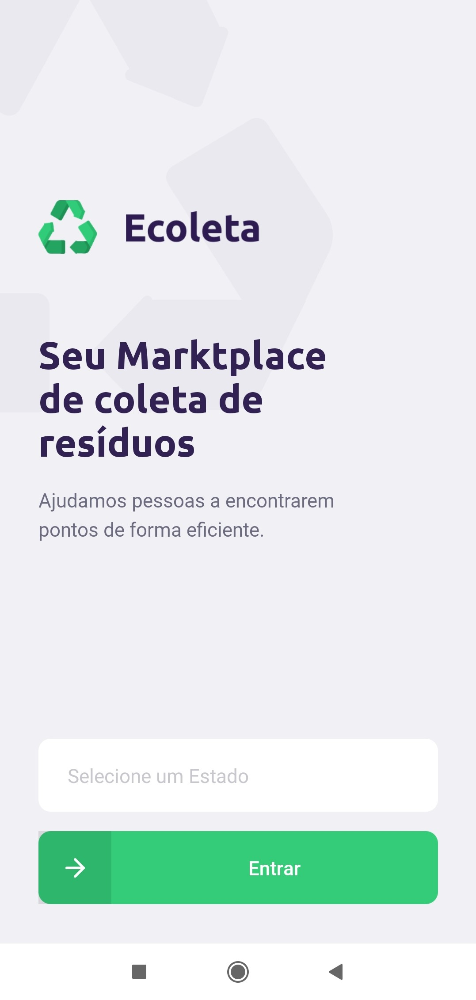
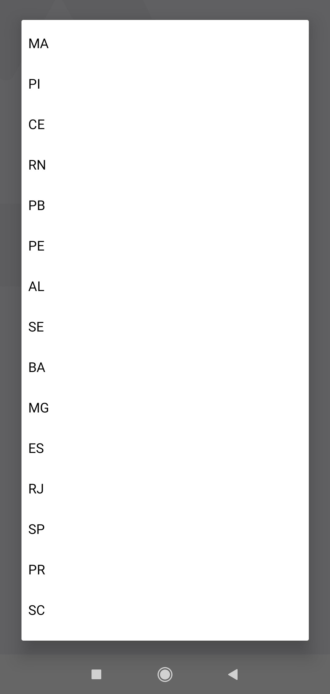
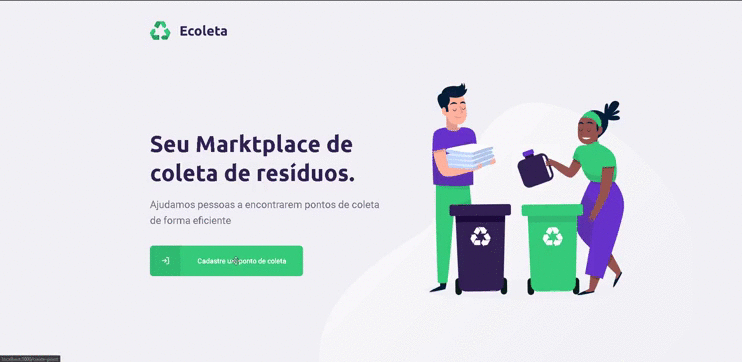

<h1 align="center">
    
</h1>

<h4 align="center"> 
	NextLevelWeek 1.0 🚀
</h4>
<p align="center">
  


  
	
  <a href="https://www.linkedin.com/in/alquiponeto/">
    
  </a>

  <a href="https://github.com/Alquipo/NLW-01-Ecoleta/commits/master">
    
  </a>

  
</p>

## :information_source: O que é Next Level Week?

O **NLW** é uma semana prática com muito código, desafios, network e com um único objetivo: levá-lo ao próximo nível.
Através do  método da [Rocketseat][rs], você aprenderá novas ferramentas, aprenderá sobre novas tecnologias e descobrirá hacks que irão impulsionar sua carreira.
Um evento online e totalmente gratuito que o ajudará a dar o próximo passo na sua evolução como desenvolvedor.

## 💻 Projeto

♻️Ecoleta é um projeto desenvolvido com base na Semana Internacional do Meio Ambiente. O objetivo é conectar as pessoas a empresas que coletam resíduos específicos, como lâmpadas, baterias, óleo de cozinha, etc. Projeto desenvolvido na trilha Booster da semana NLW.

O projeto conta com aplicação Web para cadastro dos pontos de coleta e uma aplicação mobile para visualizar os pontos de coleta

<h3 align="center">
    
</h3>

## :tada: Melhorias

Com aprendizado da **NLW** acabei realizando melhorias no projeto e consertando alguns bugs que havia ficado no projeto original

##### - Bugs Corrigidos: :bug:
  - Ajuste no envio dos números de WhatsApp da aplicação Web, estava adicionando um **.0** no final de todos os telefones ma tabela do BD;
  - Número do WhatsApp agora adiciona **+55** no envio da mensagem pelo App Mobile

##### - Melhorias na Aplicação: :medal_sports:
 - **WEB**:
  -Adicionado mascara no input  do Whatsapp;
  -Adicionado Modal com timeout na finalização do cadastro do Ponto de Coleta;
  -Add mouse Pointed em diversas partes da interface;

- **Mobile**:
  -Adicionado menu de seleção na Home do aplicativo;
  -Integrado o input-select com a api do **IBGE**;
  -Adicionado restrições para só avançar para proxima tela após selecionar o Estado e a Cidade;
  -Ajustados os Paddings dos icones para  o android

## 🎨 Layout

### Mobile

<h4 align="center">
  
  
  
  
  
</h4>

### Web
<h4 align="center">
  
  
  
</h4>

## :hammer: Tecnologias

Este projeto foi desenvolvido com as seguintes tecnologias:

- [Node.js][nodejs]
- [TypeScript][typescript]
- [React][reactjs]
- [React Native][rn]
- [Expo][expo]
- [VS Code][vs]


## :information_source: How To Use

Para clonar e executar este aplicativo, você precisará de [Git](https://git-scm.com), [Node.js][nodejs] + [Npm][npm] Instalado em seu computador.

### Install API 

```bash
# Clone this repository
$ git clone https://github.com/Alquipo/NLW1.0-AppEcoleta.git

# Go into the repository
$ cd NLW1.0-AppEcoleta/server

# Install dependencies
$ npm install

# Run Migrates
$ npm run knex:migrate

# Run Seeds
$ npm run knex:seed

# Start server
$ npm run dev

running on port 3333
```

## 🤔 How to contribute

- Make a fork;
- Create a branck with your feature: `git checkout -b my-feature`;
- Commit changes: `git commit -m 'feat: My new feature'`;
- Make a push to your branch: `git push origin my-feature`.

After merging your receipt request to done, you can delete a branch from yours.

## :memo: License

This project is under the MIT license. See the [LICENSE](https://github.com/Alquipo/NLW1.0-AppEcoleta/blob/master/LICENSE) for details.


Made with ♥ by Alquipo Neto :wave: [Get in touch!](https://www.linkedin.com/in/alquiponeto/)

[nodejs]: https://nodejs.org/
[npm]: https://www.npmjs.com/
[typescript]: https://www.typescriptlang.org/
[expo]: https://expo.io/
[reactjs]: https://reactjs.org
[rn]: https://facebook.github.io/react-native/
[vs]: https://code.visualstudio.com/
[vceditconfig]: https://marketplace.visualstudio.com/items?itemName=EditorConfig.EditorConfig
[vceslint]: https://marketplace.visualstudio.com/items?itemName=dbaeumer.vscode-eslint
[prettier]: https://marketplace.visualstudio.com/items?itemName=esbenp.prettier-vscode
[rs]: https://rocketseat.com.br


<h3 align="center"> 
	🚧 Preview  🚧
</h3>

<h3 align="center">
    
</h3>