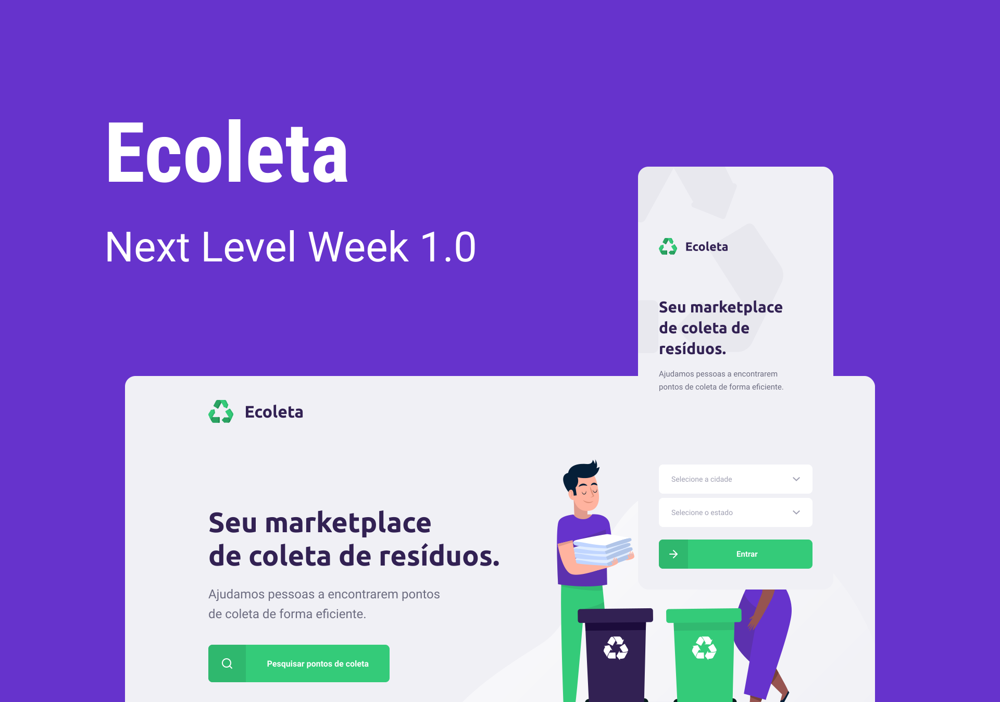
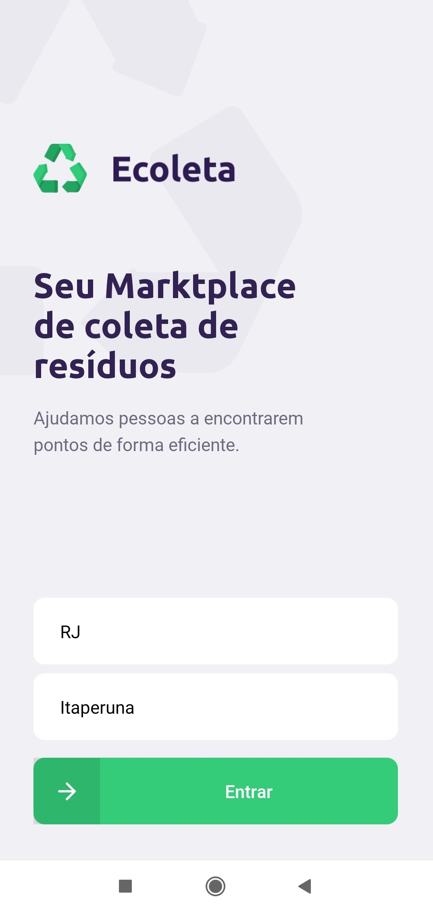
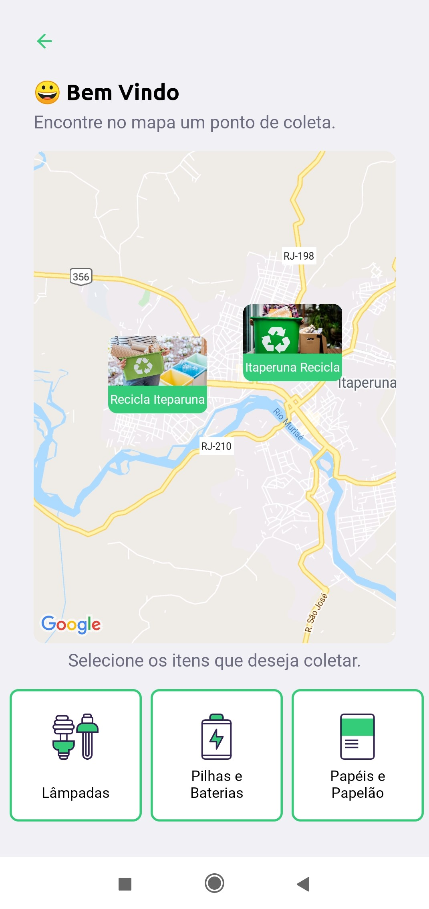
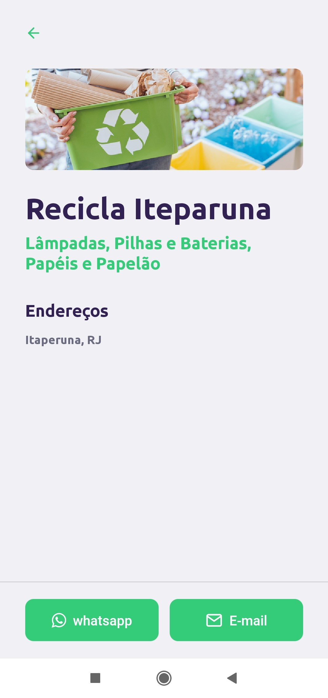
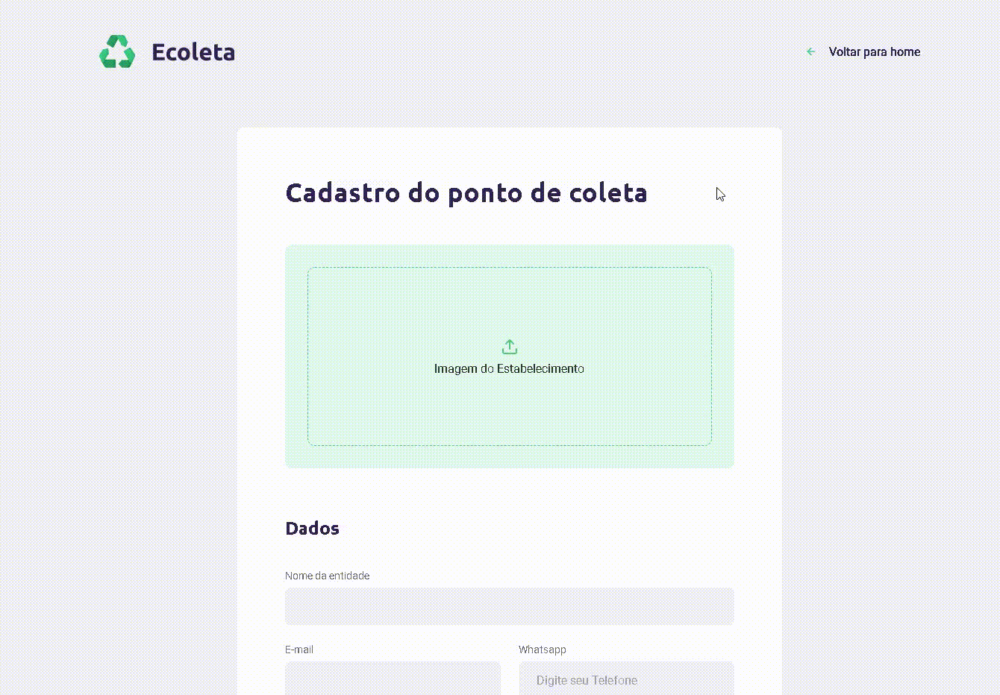
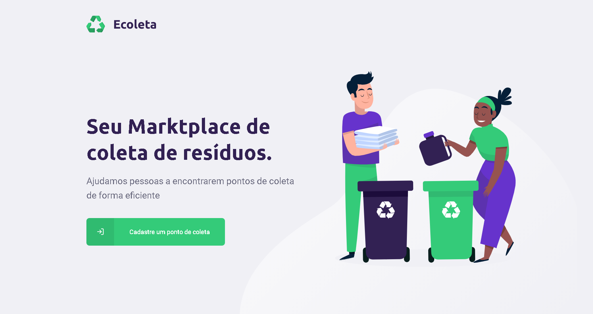
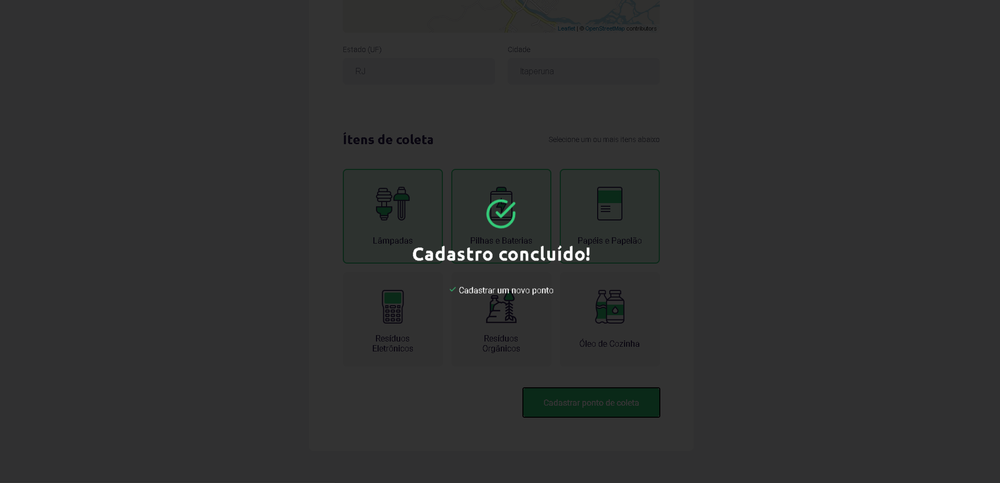

<h1 align="center">
    
</h1>

<h4 align="center"> 
	NextLevelWeek 1.0 🚀
</h4>
<p align="center">
  


  
	
  <a href="https://www.linkedin.com/in/alquiponeto/">
    
  </a>

  <a href="https://github.com/Alquipo/NLW-01-Ecoleta/commits/master">
    
  </a>

  
</p>

## :information_source: O que é Next Level Week?

O **NLW** é uma semana prática com muito código, desafios, network e com um único objetivo: levá-lo ao próximo nível.
Através do  método da [Rocketseat][rs], você aprenderá novas ferramentas, aprenderá sobre novas tecnologias e descobrirá hacks que irão impulsionar sua carreira.
Um evento online e totalmente gratuito que o ajudará a dar o próximo passo na sua evolução como desenvolvedor.

## 💻 Projeto

♻️Ecoleta é um projeto desenvolvido com base na Semana Internacional do Meio Ambiente. O objetivo é conectar as pessoas a empresas que coletam resíduos específicos, como lâmpadas, baterias, óleo de cozinha, etc. Projeto desenvolvido na trilha Booster da semana NLW.

O projeto conta com aplicação Web para cadastro dos pontos de coleta e uma aplicação mobile para visualizar os pontos de coleta

<h3 align="center">
    
</h3>

## :tada: Melhorias

Com aprendizado da **NLW** acabei realizando melhorias no projeto e consertando alguns bugs que havia ficado no projeto original

##### - Bugs Corrigidos: :bug:
  - Ajuste no envio dos números de WhatsApp da aplicação Web, estava adicionando um **.0** no final de todos os telefones ma tabela do BD;
  - Número do WhatsApp agora adiciona **+55** no envio da mensagem pelo App Mobile

##### - Melhorias na Aplicação: :medal_sports:
 - **WEB**:
  -Adicionado mascara no input  do Whatsapp;
  -Adicionado Modal com timeout na finalização do cadastro do Ponto de Coleta;
  -Add mouse Pointed em diversas partes da interface;

- **Mobile**:
  -Adicionado menu de seleção na Home do aplicativo;
  -Integrado o input-select com a api do **IBGE**;
  -Adicionado restrições para só avançar para proxima tela após selecionar o Estado e a Cidade;
  -Ajustados os Paddings dos icones para  o android

## 🎨 Layout

### Mobile

<h4 align="center">
  
  
  
  
</h4>

### Web
<h4 align="center">
  
</h4>
<h4 align="center">
  
  
  
</h4>

## :hammer: Tecnologias

Este projeto foi desenvolvido com as seguintes Ferramentas:

- [Node.js][nodejs]
- [TypeScript][typescript]
- [React][reactjs]
- [React Native][rn]
- [Expo][expo]
- [VS Code][vs]


## 🚀 Como rodar este projeto

Para clonar e executar este aplicativo, você precisará de [Git](https://git-scm.com), [Node.js][nodejs] + [Npm][npm] Instalado em seu computador.

O projeto e divido em três partes:

1. Back End (pasta server) 
2. Front End (pasta web)
3. Mobile (pasta mobile)

💡 Tanto o Front End quanto o Mobile precisam que o Back End esteja sendo executado para funcionar.

### Clonando o repositorio

```bash
# Clone este repositório
$ git clone https://github.com/Alquipo/NLW-01-Ecoleta.git

# Acesse a pasta do projeto no terminal/cmd
$ cd NLW-01-Ecoleta
```

### 🎲 Rodando o Back End (servidor)

```bash
# Acesse a pasta do projeto do servidor
$ cd server

# Instale as dependências
$ npm install

# Acesse a pasta com a configuração do BD
$ cd src/database 

edita o arquivo 'connection.ts' ou cria um arquivo 'database.sqlite' na pasta database

# Execute as Migrates
$ npm run knex:migrate

# Execute as Seeds
$ npm run knex:seed

# Execute a Aplicação
$ npm run dev

# O servidor inciará na porta:3333 - acesse http://localhost:3333 

```
### 🧭 Rodando a aplicação web (Front End)

```bash

# Vá para a pasta da aplicação Front End
$ cd web

# Instale as dependências
$ npm install

# Execute a aplicação
$ npm run start

 # A aplicação será aberta na porta:3000 - acesse http://localhost:3000
```

### 📱Rodando a aplicação mobile 
```bash
# Vá para a pasta da aplicação Front End
$ cd mobile

# Instale as dependências
$ npm install

# Execute a aplicação
$ expo start

# A aplicação será aberta na porta:19002 - acesse http://localhost:19002

# Use o App expo baixado no seu celular para scan o QRCode
```
## 🤔 Como contribuir para o projeto

- Faça um **fork** do projeto;
- Crie uma nova branch com as suas alterações: `git checkout -b my-feature`
- Salve as alterações e crie uma mensagem de commit contando o que você fez:` git commit -m "feature: My new feature"`
- Envie as suas alterações: `git push origin my-feature`

> Caso tenha alguma dúvida confira este [guia de como contribuir no GitHub](https://github.com/firstcontributions/first-contributions)

## :memo: License

Este projeto esta sobe a licença MIT. Veja a [LICENÇA](license) para saber mais.


Feito com ❤️ por Alquipo Neto 👋🏽 [Entre em contato!](https://www.linkedin.com/in/alquiponeto/)

[nodejs]: https://nodejs.org/
[typescript]: https://www.typescriptlang.org/
[expo]: https://expo.io/
[reactjs]: https://reactjs.org
[rn]: https://facebook.github.io/react-native/
[vs]: https://code.visualstudio.com/
[rs]: https://rocketseat.com.br
[license]: https://opensource.org/licenses/MIT

